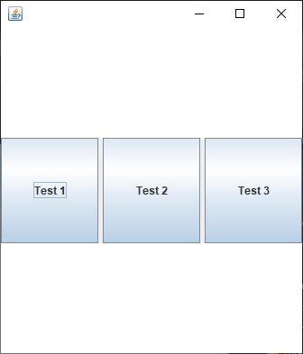
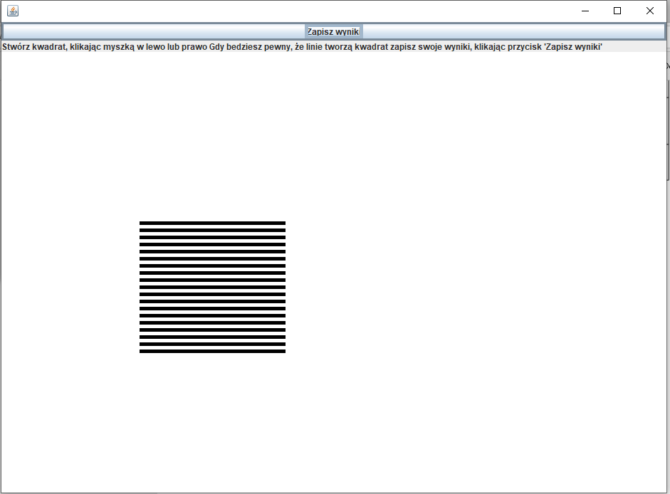
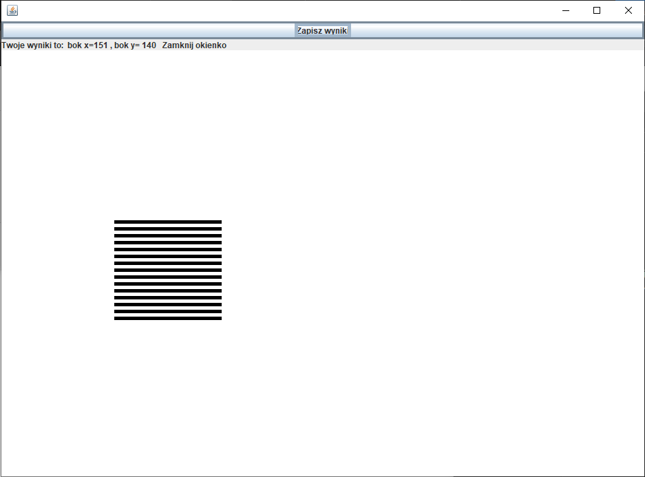

# IllusionProject
Project in Java for test optic illusion  
A program created to examine the optical illusion based on a square drawn from horizontal lines of different filling. 
The program user has the task of solving three tests.  
 
In these tests, he must set the side length of the figure to create a square and save his result.
After clicking one of the test button, there will open new window that example shown below :

After clicking button ,,Zapisz" the result will be saved in a text file and displayed on the top of the window

